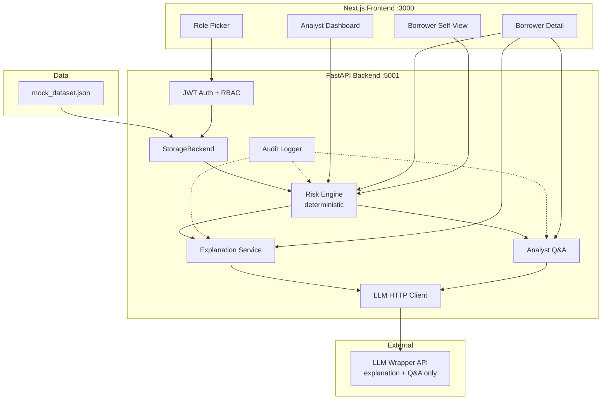

# Architecture — Loan Default Risk Early Warning System

## System overview



## Critical design boundary

```
┌─────────────────────────────────────────────────────────┐
│  DETERMINISTIC (never LLM)                              │
│  • Risk score, category, severity, recommended action   │
│  • Signal detection (DPD, utilization, income, etc.)    │
│  • Borrower-facing template message                     │
└─────────────────────────────────────────────────────────┘
                          │
                          ▼ pre-computed assessment
┌─────────────────────────────────────────────────────────┐
│  LLM (narration only)                                   │
│  • Analyst explanation (streamed)                         │
│  • Analyst Q&A grounded in borrower JSON context        │
│  • Post-LLM guard detects category/score override attempts│
└─────────────────────────────────────────────────────────┘
```

## Backend modules

| Module | Path | Responsibility |
|--------|------|----------------|
| Risk engine | `app/services/risk_engine.py` | Rule-based scoring |
| Config | `app/config.py` | Thresholds & assumptions |
| Storage | `app/storage/` | File JSON today; DB stub |
| Auth | `app/auth/` | JWT, RBAC dependencies |
| Security | `app/security/` | Input validation, LLM guard |
| Middleware | `app/middleware/` | Rate limit, headers, request ID |
| Observability | `app/observability/` | Prometheus counters |
| Routers | `app/routers/` | REST + SSE endpoints |

## Data flow — analyst opens a borrower

1. Frontend sends `Authorization: Bearer <JWT>`
2. `assert_can_view_borrower` checks analyst assignment
3. `assess_borrower()` runs deterministic scoring
4. Assessment returned immediately to UI
5. Explanation panel calls SSE `/explanation/stream` (LLM narrates step 3 result)
6. Audit log records `VIEW_ASSESSMENT`, `LLM_EXPLANATION`

## RBAC model

| Role | Data scope | LLM access |
|------|------------|------------|
| Borrower | Own borrower_id only | None — deterministic template |
| Analyst | `assigned_analyst_id` match | Explanation + Q&A + scenario |
| Manager | Full portfolio | Same as analyst |

## Risk engine signals

| Signal | Source data |
|--------|-------------|
| DPD trend / current DPD | `payments[]` |
| Failed auto-debits | `payments[].auto_debit_failed` |
| Utilization / rising util | `balance_history[]`, loan limits |
| Income decline | `transactions[]` (income credits) |
| Balance decline | `balance_history[]` |
| Partial/skipped payments | `payments[].status` |
| Insufficient history | payment count < config minimum |

Score bands → category: Watchlist (20+) · High Risk (45+) · Critical (70+)

## Deployment topology

```text
Development:
  uvicorn :5001  +  next dev :3000

Production (documented):
  gunicorn + uvicorn workers :5001
  next start :3000 (or static CDN)
  JWT_SECRET + CORS_ORIGINS + IdP (future)
```

## Extension points

| Future need | Hook |
|-------------|------|
| PostgreSQL | Implement `DatabaseStorage` |
| Real-time ingestion | Replace file load with event consumer |
| IdP SSO | Swap `POST /auth/login` for OIDC callback |
| Batch nightly scoring | Worker reading `StorageBackend` → alerts table |

See [backend/README.md](backend/README.md) for full API and security details.
