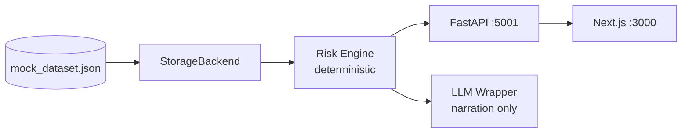

# Biz2X — Loan Default Risk Early Warning System

Proactive early-warning prototype for the Biz2X SSE case study: flag borrowers likely to become delinquent within **30 days**, surface explainable alerts, and ground analyst Q&A in borrower data.

[](https://github.com/chirag26sharma/biz2x-assignment/actions)

## Repository layout

```text
biz2x-assignment/
├── backend/              FastAPI API, risk engine, JWT auth, LLM integration
├── frontend/             Next.js (TypeScript) analyst & borrower UI
├── GETTING_STARTED.md      ← How to run (start here)
├── ARCHITECTURE.md         System design & diagrams
├── DEMO.md                 5-minute interview walkthrough
├── SUBMISSION.md           Pre-submit checklist
├── docker-compose.yml
└── .github/workflows/ci.yml
```

## Architecture (high level)



## Critical design rule

**Risk category, severity, and recommended action are never produced by the LLM.**  
The rule engine scores deterministically; the LLM only narrates results and answers grounded analyst questions.

## Quick start

> **Full guide:** [GETTING_STARTED.md](GETTING_STARTED.md)

**Terminal 1 — Backend (port 5001):**
```bash
cd backend
python -m venv .venv && .venv\Scripts\activate   # Windows
pip install -r requirements.txt && copy .env.example .env
uvicorn app.main:app --reload --port 5001
```

**Terminal 2 — Frontend (port 3000):**
```bash
cd frontend
npm install && npm run dev
```

Open [http://localhost:3000](http://localhost:3000) → pick demo user **A001** or **U_B101**.

**Docker:** `docker compose up --build` from repo root.

## Demo users

| Login ID | Role | Access |
|----------|------|--------|
| A001 | Analyst | B101, B102, B103, B107, B109 |
| A002 | Analyst | B104–B106, B108, **B110** |
| M001 | Manager | Full portfolio |
| U_B101 … U_B110 | Borrower | Own account only |

**Interview showcase:** B110 (Critical) vs B101 (Low) — see [DEMO.md](DEMO.md)

## Tests

```bash
# Backend — 32 tests
cd backend && pytest tests -v

# Frontend E2E — 4 tests (requires both servers running)
cd frontend && npm install && npx playwright install chromium && npm run test:e2e
```

## Documentation index

| Document | Purpose |
|----------|---------|
| [GETTING_STARTED.md](GETTING_STARTED.md) | **How to install & run** (Windows/macOS/Linux) |
| [ARCHITECTURE.md](ARCHITECTURE.md) | System design, data flow, RBAC |
| [DEMO.md](DEMO.md) | 5-minute interview demo script |
| [SUBMISSION.md](SUBMISSION.md) | Pre-submission checklist |
| [backend/README.md](backend/README.md) | API reference, assumptions, security |
| [frontend/README.md](frontend/README.md) | UI routes & env vars |

## Stack

| Layer | Technology |
|-------|------------|
| Backend | FastAPI, Pydantic, PyJWT |
| Frontend | Next.js 16, TypeScript, Tailwind |
| Scoring | Deterministic rule engine |
| LLM | Anthropic wrapper (explanation + Q&A only) |
| Storage | JSON file (`StorageBackend` abstraction) |
| Tests | pytest (32) + Playwright E2E (4) |

## Features

- Deterministic risk engine with configurable thresholds
- Analyst dashboard sorted by severity + portfolio summary
- Streaming LLM explanations with post-LLM guardrails
- Grounded analyst Q&A with injection filtering
- Borrower self-view (plain deterministic update, no LLM)
- DPD trend chart + payment history table
- JWT auth, RBAC, audit logging, rate limiting
- `/health`, `/ready`, `/metrics` production probes

## License / context

Built as a take-home assignment for **Biz2X Senior Software Engineer** — Loan Default Risk Early Warning System case study.
